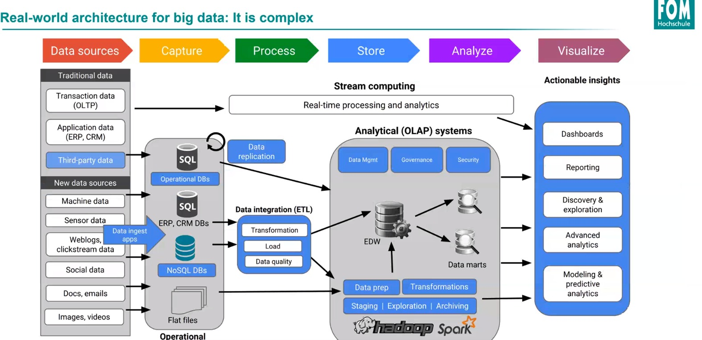

# Big Data und Infrastruktur

## HINWEIS
**Alle Folien zu Cloud werden in der Klausur wichtig**

## Was ist Big Data?

### Definition / Einführung

- Keine Standarddefinition
  - Erstmalig GARTNER Group (2012): High volume, high velocity, high variety => require new forms of processing
- Kein Unterschied zu Business Intelligence
- Treffender: Highest Volume (unbeherrschbar)
- 3 (4, 5) V's (Klausur)
  - Volume, Scale of Data
  - Velocity, Analysis of Streaming Data
  - Variety, Different Forms of Data
  - (Veracity, Uncertainty of Data)
  - (Value)
- Volume
  - Die Menge der Daten
  - Most Companies have 100TB each
  - 2.3 Billionen GB every day
  - 6 Mrd. have a cellphone
  - 40 Zettabytes created 2020
- Velocity
  - Der "Ursprung" von Daten
  - Modern Cars 100 Sensors
  - 1TB NYSE Data every day
  - 19 Mrd. Network Connections each day
- Variety
  - Die "Arten" von Daten
  - 150 Exabytes in Healthcare
  - 30 Mrd. Posts auf Facebook jeden Monat
  - 400 Mio Tweets jeden Tag (200 Mio aktive User pro Monat)
  - 420 Mio Wearables (Smartwatch etc.)
  - 4+ Mrd. Videos jeden Monat auf Youtube geschaut
- Veracity
  - Die "Qualität" der Daten
  - 1/3 Business Leaders don't trust information for decision making
  - 27% of Respondents in one survey where unsure how much of their data was inaccurate
  - Poor Data Quality costs the U.S. 3.1 Billionen Dollar / Jahr

### Big Data aus Sicht der Softwarehersteller

- Big Data = Transactions + Interactions + Observations

### Datenmengen (Klausur)

- Size stored:
  - Google: 15.000 Petabytes
  - NSA: 10.000 Petabytes
  - Facebook: 300 Petabytes
  - eBay: 90 Petabytes
- Data processed per Day
  - Google: 100 PB
  - eBay: 100 PB
  - NSA: 28 PB
  - Facebook: 0,6 PB
  
 ## Landscape
 4 Kategorien von Daten
 - Infrastruktur
    - Prozess und Speicherung, ggf. auch Analyse von Daten
 - Integration
    - Analyse auf mehreren Ebenen
 - Engineering
    - Monetarisierung 
 - Analytics
    - Generierung von Nutzen/Mehrwert durch Analyse von Daten
 
## Typen der Datenanalyse
- Kundenprobleme
    - Business Sense of Data
    - Real Time oder Batch Analyse für Prediktionen
        - Real Time Probleme sind Probleme die keine Latenz erlauben (COVID-19, Fraud Detection)
        - Batch erlaubt es zu klären, warum etwas passiert ist und wie sich daraus zukünftige Ereignisse ableiten lassen (Amazon & eBay Kaufempfehlung)
 
### Definitionen
- alle nicht einheitlich
- KLAUSUR: Definitionen und Gemeinsamkeiten & Unterscheide BD & BI **VERSTEHEN** und **EIGENE RECHERCHEN** | Eigene Beispiel und aktuelle Entwicklung (weniger BI mehr BD Jobs)
### Big Data
- BITKOM: Datenmenge (Volume), Datenvielfalt (Variety), Datengeschwindigkeit (Velocity), Erkennen von Zusammenhängen (Analytics)
    - 3 V's + Analytics
- Größtenteils Auswertungen auf unstrukturierten Daten
    
### Business Intelligence
- Sammelbegriff für den IT-gestützten Zugriff auf Daten
- Aus diesem Wissen soll Handlungsentscheidungen des Managements ermöglichen
- Unterschied zu BD --> strukturierte Daten werden verdichtet für "einfache Antworten"

### Data Science
- Mischung aus BD & BI
- Sinnvolle Informationen aus strukturierten Daten aus der BI und den unstrukturierten Daten der BD ziehen
- Dient ebenfalls der Entscheidungsfindung
- Zusammenhang BI --> Überschneidungen
- DS dient eher der Prediktion

## Cloud Computing
- Def (BSI): Dynamisches Anbieten, Nutzen und Abrechnen von IT-Dienstleistungen

## Unterschiedliche Ansätze der IT
### Traditionelle IT
- Sicherheit
- Effizienz
- Ruhe & Genauigkeit

### Non-lineare IT
- Nicht sequentiell
- Agil, z.T. vieles im Beta-Stadium
- Hoher Innovationsgrad
- Unruhe im Sinne von kont. Weiterentwicklung

## Handlungsfelder der Cloud
- Strategie
    - Roadmap von OnPrem zu Cloud
- Architektur & Technologie
    - Sichere Infrastruktur
    - u.a. SaaS
- Migration
    - Methoden
    - Vertragsauswahl
- Datenschutz
    - Compliance
    - Anonymisierung
    - Pers.bezo und F&E-Daten
- Datensicherheit
    - Verschlüsselung
    - Schutz vor Zugriff Dritter
- Governance
    - Mitarbeiter & Skills
    - Motivation / Mindset
    
## 4 Säulen der Digitalisierung
- Zukunftsorientierte Mensch-Maschine Interaktion
- Ganzheitliche Integrationsarchitekturen
- Effektive Analytics & Business Insights
- Reaktionsfähige hybride Infrastrukturen

## Cloud Modelle (WICHTIG KLAUSUR, Folien 49 - 55)
_vermutlich noch mehr als hier steht_
### IaaS
_Infrastructure as a Service_
- Rechner und Speicherkapzitäten werden gemietet
- Zielgruppe: Kunden die Hardwarekosten sparen wollen

### PaaS
_Platform as a Service_
- Laufzeitumgebung für Webanwendungen, Test- oder Entwicklungsumgebungen
- Zielgruppe: Kunden, die schnell Umgebungen benötigen, diese aber nicht vorhalten wollen

### SaaS
_Software as a Service_
- Software on Demand, pay as you use
- standardisierte Software (Dropbox, Office365)
- Kunden die Software nur nutzen möchten und keine Verantwortung über SLA oä. haben möchten

### Grad der Integration
IaaS --> PaaS --> SaaS

## Cloud-Typen (KLAUSUR, Folie 56)
### Private Cloud
- Kunde betreibt die Cloud
- Services werden nur für die interne Nutzung bereitgestellt
- hohe Investitionkosten
- **Interne-IT mit Cloud-Mechanismen**

### Public Cloud
- nicht öffentlich für alle, sondern von jedem "mietbar"
- Zahlung nach Nutzung, sehr geringe Investitionskosten
- **komplett ausgelagerte IT**

### Hybrid Cloud
- Mischform
- meist auf das wesentliche konzentriert

## Virtualisierung in der Cloud
- ermöglicht maßgeschneiderte Server
- Linux das meist-virtualisierte System in der Azure Cloud

## Faktoren für die Entscheidung für eine Cloud
- Ausfallsicherheit
- Produktivität
- Flexibilität
- Datenschutz und -sicherheit
- Kosten
- Externe Abhängigkeit  

## Self-Managed vs. Provider Managed (KLAUSUR)
4 Bereiche zu vergleichen
- Betrieb
- Security
- Kontrolle
- Hochverfügbarkeit

## Datenbanken
- Markt verlagert sich in Open Source

### Gründe für RDS
- Einfach einzuarbeiten
- schnell und skalierbar
- verfügbar und langlebig
- sicher
- kostengünstig

## Was ist ein Data Lake?
- entkoppelte Speicherung und Berechnung
- schnelle Übernahme und Transformation
- sichere Mandantenfähigkeit

### Welche Varianten der Umsetzung gibt es
- Cloud
- HDP/NoSQL Cluster
- (R)DBMS

## Big Data Architektur

### Lift & Shift (46/47 Klausur!)
- Einzelne Applikationen werden von OnPrem in die Cloud "gehoben"
- Vorteile:
    - Standardisierung
    - Nutzung einiger Cloud-Vorteile
    - Geringere Betriebskosten
- Nachteile:
    - Migrationsrisiko
    - Nicht alle Cloud-Vorteile
    - Nicht alle Technologien möglich
- Anwendungsfelder:
    - Unternehmensapplikationen
    - Spezielle Applikationen
    
## Datenverarbeitung
- Scale Up & Scale Out
### Scale Up
- vertikal
- mehr RAM, CPU, HDD, etc.
- imitieren des Großrechnersystems
- keine lineare Skalierung (n neue CPU != n-fache neue Leistung)

### Scale Out
- horizontal
- gleiche Hardware über Netzwerk verbunden (Clustering)
- Vendor Lock (schwer anderen Anbieter zu wechseln)
- höhere Kosten

### Arten von Daten
- strukturiert
- semi-strukturiert
- unstrukturiert

### Datenstrom
- Folge von Daten-Tupeln
- Daten bewegen sich (Data ist moving)
- Kontinuierlich generiert
- z.B. Sensoren, Real-Time Analyse Aktienmarkt, WebShop

## CAP-Theorem (nicht Klausur)
- BASE Ansatz, Basically Available Soft State and Eventual Constistency
    - Unschärfeansatz
- ACID Ansatz, Atomicity Consistancy, Isolation and Durability (RDBMS Umfeld)
- Vergleich ACID / BASE Folie 39
- Kann nicht allem gerecht werden, Verfügbarkeit, Ausfalltoleranz, Konsistenz stehen in "Konkurrenz"

## Datenschutz
- nicht Teil der Klausur, aber ggf. wird vorausgesetzt, dass die DSGVO bekannt ist.

## Folie 66 MALEN KÖNNEN!!!