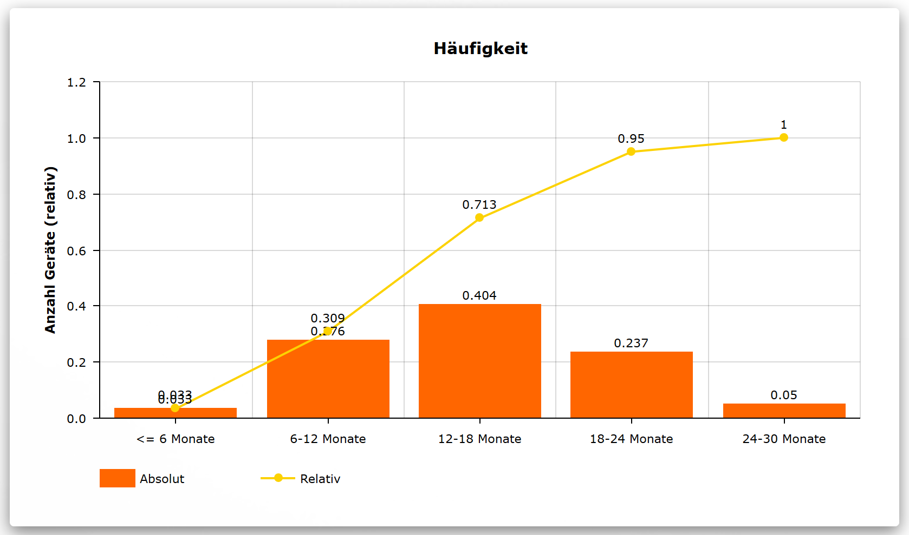
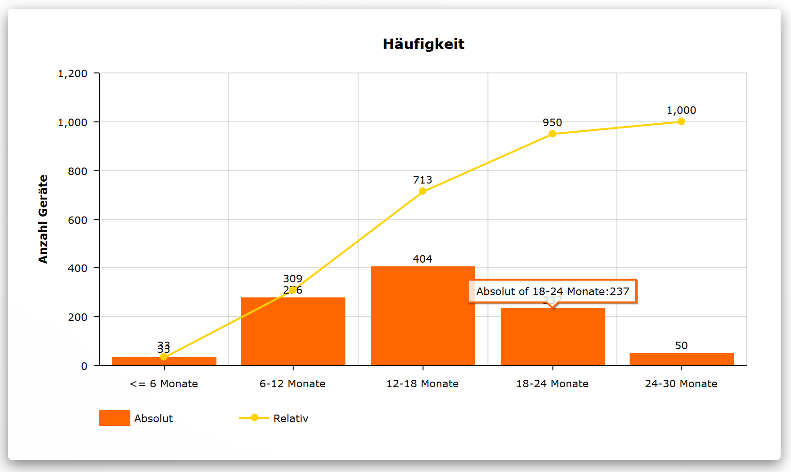
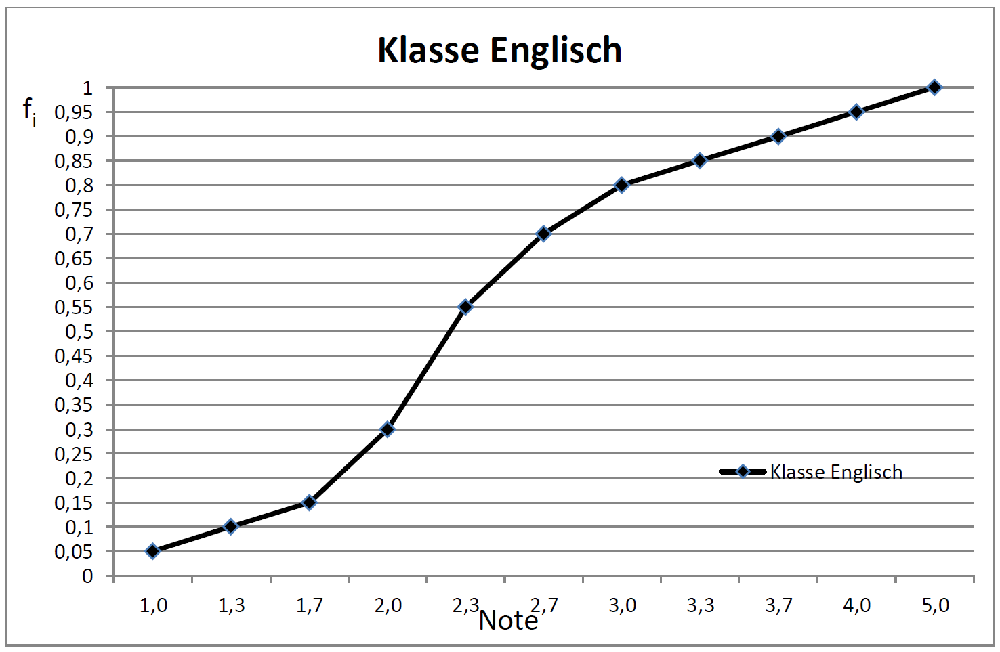

# Aufgabenblatt 1

## A.1
Bei Smartphones eines bestimmten Herstellers wurden bei 1000 Geräten folgende Lebensdauer (in Monaten) des Displays festgestellt:

| Lebensdauer   | <= 6 Monate | 6-12 Monate | 12-18 Monate | 18-24 Monate | 24-30 Monate |
|---------------|-------------|-------------|--------------|--------------|--------------|
| Anzahl Geräte | 33          | 276         | 404          | 237          | 50           |

Stellen Sie die **Häufigkeitsverteilung** und die **Summenhäufigkeitsverteilung** (absolut und relativ) dar.

### Antwort A.1
Relative Häufigkeit berechnen
| Lebensdauer   | <= 6 Monate | 6-12 Monate | 12-18 Monate | 18-24 Monate | 24-30 Monate |
|---------------|-------------|-------------|--------------|--------------|--------------|
| Anzahl Geräte | 33          | 276         | 404          | 237          | 50           |
| Relativ       | 33 / 1000   | 276 / 1000  | 404 / 1000   | 237 / 1000   | 50 / 1000    |
|               | 0.033       | 0.276       | 0.404        | 0.237        | 0.050        |

**Häufigkeitsverteilung (relativ)**

**Häufigkeitsverteilung (absolut)**

## A.2
An der FOM wurde im 2. Semester eine Klausur im Fach Business English durchgeführt. An der Klausur nahmen 200 Studierende Teil. Die Auswertung hat folgendes Ergebnis ergeben:

Wie viele der Studierenden haben besser als 3,7 und schlechter als 1,7 abgeschlossen?

### Antwort A.2
_Besser als 3,7 und schlechter als 1,7:_

Ablesen vom Graph bei 3,3 (besser als 3,7): 0.85

Alle die schlechter sind als 1,7 (ablesen bei 1,7): 0.15

--> Die besser als 1,7 zusätzlich abziehen: 0.85 - 0.15 = 0.7

--> 70% von 200 = 140 Studierende

## A.3
Kurt Krömer trainiert für den Triathlon (Olympische Distanz) täglich exakt eine Stunde auf dem Rad mit folgenden Ergebnissen (in Kilometer):

| Tag       | 1    | 2    | 3    | 4    | 5    |
|-----------|------|------|------|------|------|
| Kilometer | 16,1 | 17,2 | 18,6 | 18,8 | 20,2 |

a. Welche Geschwindigkeit hat Kurt Krömer im Schnitt geschafft?

b. Um wie viel Prozent hat Kurt seine Kilometerleistung im Schnitt gesteigert?

## Antwort A.3
a.

Durchschnitt = 1/5 x (16,1 + 17,2 + 18,6 + 18,8 + 20,2) = 18,8 KM/h

b. 

Tag 1 auf 2: 6,83%

Tag 2 auf 3: 8,14%

Tag 3 auf 4: 1,08%

Tag 4 auf 5: 7,45%

Durchschnitt = 1/4 x (6,83 + 8,14 + 1,08 + 7,45) = 5,88% Steigerung pro Tag

## A.4
Kurt Krömer fährt mit seinem Mini von Berlin nach Prenzlau (etwa 100 km) mit einer Durchschnittsgeschwindigkeit von 80 km/h. Anschließend fährt er mit durchschnittlich 120 km/h von Prenzlau nach Berlin und legt dabei ebenfalls 100 km zurück. Wie schnell fuhr er im Schnitt?

## Antwort A.4

## A.5
Als Mitarbeiter der Stiftung Warentest haben Sie zur Aufgabe, die Toleranzen bei einem Schokoriegelhersteller zu überprüfen. Hierfür haben Sie bei zehn unterschiedlichen Lieferanten je einen Schokoriegel bestellt.

## Antwort A.5
